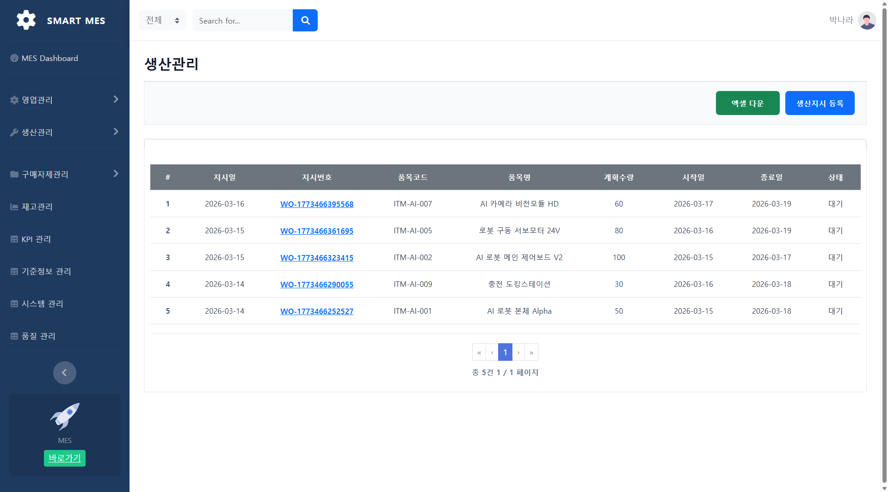
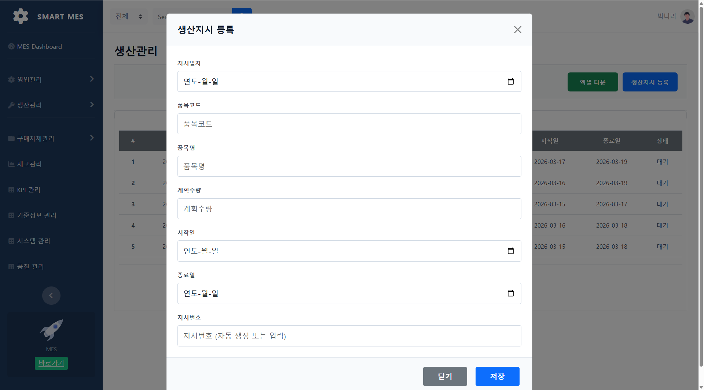
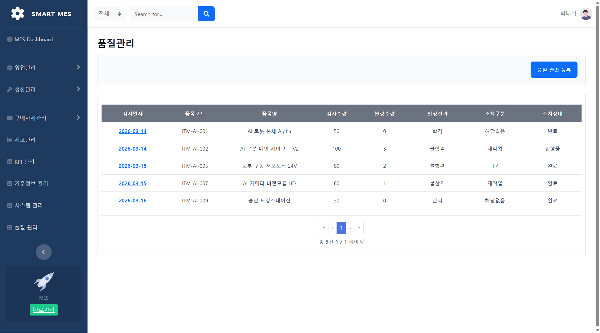
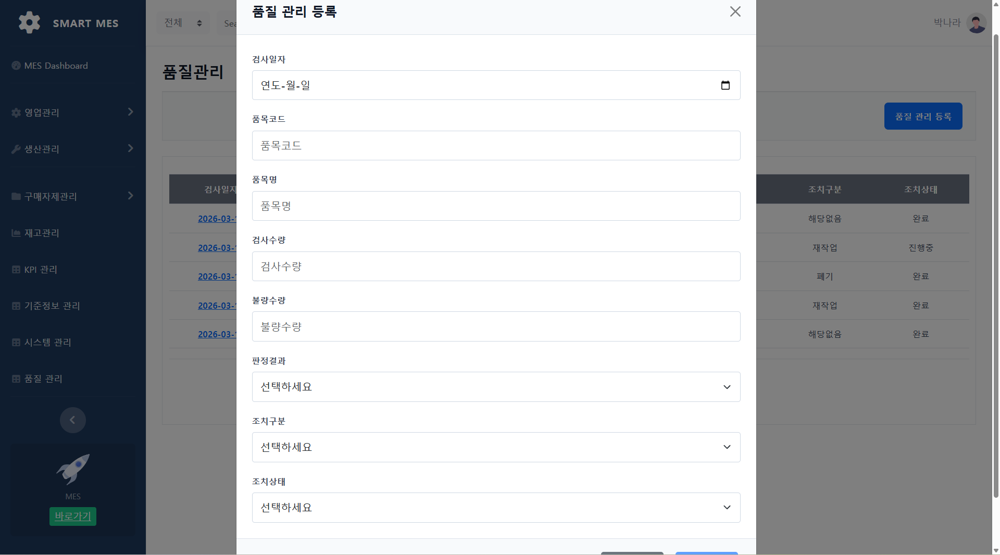

# DAON MES – Manufacturing Execution System (Frontend)

React + TypeScript + Vite 기반으로 개발한 **MES 프론트엔드 프로젝트**입니다.  
생산 현장 및 작업 흐름과 관련된 화면 구성을 중심으로,  
제조 실행 시스템(MES)의 업무 흐름을 UI로 구현하기 위해 설계했습니다.

단순 화면 구성을 넘어,  
**생산 및 품질 프로세스를 고려한 MES 플랫폼**을 목표로 개발했습니다.

---

## 📌 Project Overview

DAON MES Frontend는 생산 및 품질 흐름을 관리하기 위한  
MES 프론트엔드 프로젝트입니다.

React 기반으로 구현되었으며,  
생산 현장 업무에 필요한 기본 화면 구조와 페이지 흐름을 구성하는 데 중점을 두었습니다.

### 핵심 목표
- MES 시스템 UI 기본 구조 구성
- 생산 / 품질 관련 화면 구현
- 업무 흐름을 고려한 페이지 설계
- 향후 API 연동이 가능한 프론트엔드 기반 마련

---

## 🚀 Tech Stack

### Frontend
- **React**
- **TypeScript**
- **Vite**
- SCSS / CSS

### Dev Tools
- Git
- GitHub
- VS Code / IntelliJ

---

## ✨ Main Features

### 🏭 생산관리
- 생산지시 목록 조회
- 생산 계획 및 기간 확인
- 생산지시 등록 기능
- 엑셀 다운로드 버튼 UI 구성

### ✅ 품질관리
- 검사 이력 목록 조회
- 판정결과, 조치구분, 조치상태 확인
- 품질 관리 등록 기능
- 검사 수량 및 불량 수량 입력 화면 구성

### 🧩 UI 구조 설계
- 사이드바 기반 메뉴 구성
- 목록 / 등록 모달 중심 화면 흐름 설계
- 생산 및 품질 업무 흐름에 맞춘 페이지 구성
- 향후 기능 확장을 고려한 구조 구성

---

## 🔄 Workflow

1. 사용자가 생산관리 화면에서 생산지시 목록을 조회
2. 필요한 경우 생산지시 등록 모달을 통해 생산 계획을 등록
3. 품질관리 화면에서 검사 이력을 조회
4. 품질 관리 등록 모달을 통해 검사 결과와 조치 내용을 입력
5. 향후 API 연동을 통해 실제 데이터 처리 구조로 확장

---

## 🖼 Screenshots

### 1. 생산관리
생산지시 목록을 조회하고 지시일, 지시번호, 품목코드, 계획수량, 시작일, 종료일, 상태를 확인할 수 있는 화면입니다.



### 2. 생산지시 등록
지시일자, 품목코드, 품목명, 계획수량, 시작일, 종료일, 지시번호를 입력하여 생산지시를 등록하는 화면입니다.



### 3. 품질관리
검사일자, 품목코드, 품목명, 검사수량, 불량수량, 판정결과, 조치구분, 조치상태를 확인할 수 있는 화면입니다.



### 4. 품질관리 등록
검사일자, 품목코드, 품목명, 검사수량, 불량수량, 판정결과, 조치구분, 조치상태를 입력하여 품질 이력을 등록하는 화면입니다.



---

## 🛠 Getting Started

### 1. Clone repository
```bash
git clone https://github.com/Nara-Park-513/mes-frontend.git
cd mes-frontend
```

### 2. Install dependencies
```bash
npm install
```

### 3. Run development server
```bash
npm run dev
```

### 4. Open in browser
```bash
http://localhost:5173
```

---

## 🎯 Project Purpose

- 생산 및 품질 흐름을 고려한 MES 프론트엔드 구조 설계
- 제조 실행 시스템에 필요한 화면 중심 UI 구현
- 향후 백엔드 API 연동을 고려한 확장 가능한 구조 마련
- 실제 업무 프로세스를 반영한 프론트엔드 프로젝트 경험 축적

---

## 🔮 Future Improvements

- 생산 / 품질 화면 기능 확장
- API 연동을 위한 서비스 모듈 작성
- 공통 레이아웃 및 UI 컴포넌트 개선
- 데이터 검증 및 입력 흐름 개선

---

## 👩‍💻 Author

DAON MES Frontend Project