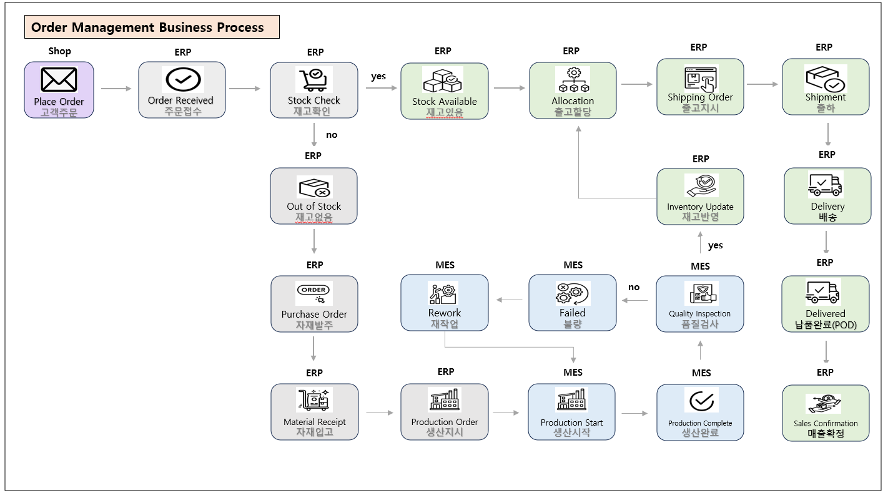
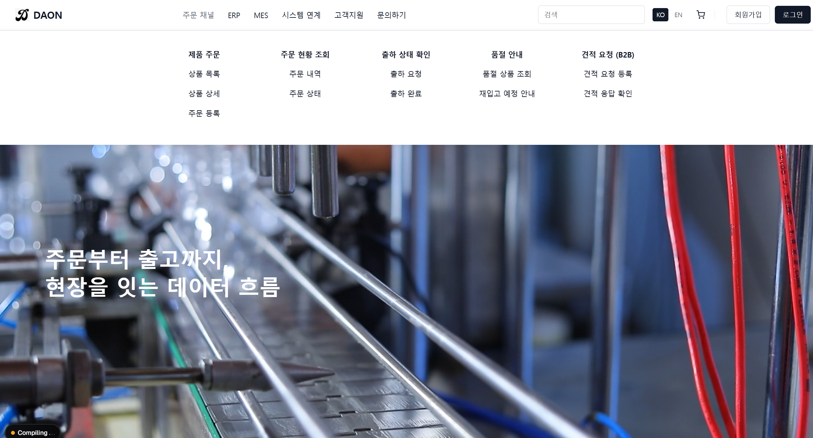
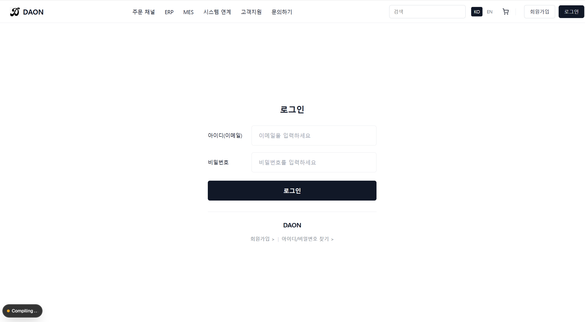
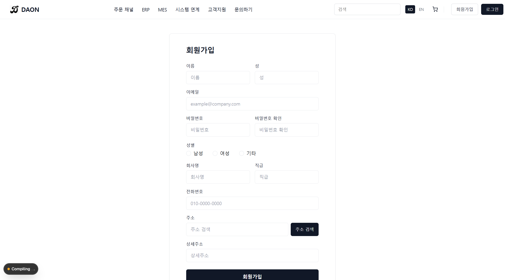

# MES Frontend Web Application

본 프로젝트는 **MES(Manufacturing Execution System)** 도메인을 기반으로  
제조 현장의 **영업 → 생산 → 재고 흐름을 웹 화면으로 관리하기 위해 설계한 프론트엔드 웹 애플리케이션**입니다.

단순 화면 구현을 넘어,  
**도메인 이해를 기반으로 한 UI 설계와 백엔드 REST API 연동을 고려한 컴포넌트 구조 설계**를 목표로 개발했습니다.

---

## 🔎 프로젝트 개요

- MES 실무 화면 흐름을 참고한 UI 설계
- 테이블 중심의 현장형 화면 구성
- 공통 레이아웃 기반 화면 구조
- REST API 연동을 고려한 프론트엔드 아키텍처 설계
- 유지보수 및 확장을 고려한 컴포넌트 분리

---

## 🔁 Order Management Business Process (ERP · MES 연계)

본 프로젝트의 MES 화면은  
**ERP–MES 통합 업무 흐름 중 생산·품질·재고 연계 영역**을 담당합니다.

아래 다이어그램은  
고객 주문부터 매출 확정까지의 전체 흐름 중  
**MES가 개입되는 생산 단계와 품질 관리 흐름을 중심으로 표현한 구조**입니다.

  

### 🔹 MES 담당 영역 요약
- ERP 생산지시 수신
- 생산 시작 / 진행 / 완료 관리
- 품질 검사 결과 처리
- 불량 발생 시 재작업 흐름 관리
- 생산 완료 결과 ERP 재고 반영 연계

---

## 🧱 전체 화면 구조

- 공통 레이아웃 (Header / Sidebar / Content) 분리
- 페이지 단위 라우팅 구조
- 도메인별 화면 구성 (영업 / 생산 / 재고)
- 테이블 / 검색 / 등록 모달 중심 UI 설계
- 백엔드 API 응답 구조 기준 데이터 모델 설계

---

## 🏭 메인 화면

  

- 주문부터 출고까지의 데이터 흐름을 시각적으로 표현한 메인 화면
- ERP · MES · 주문 채널 간 연계 구조를 한눈에 확인 가능
- 제조 현장 중심 서비스 성격을 강조한 Hero UI 구성

---

## 🔐 로그인 화면

  

- MES 시스템 진입을 위한 로그인 화면
- 내부 사용자 계정 기반 인증 구조 고려
- 불필요한 요소를 제거한 최소 입력 중심 UI 구성

---

## 📝 회원가입 화면 (B2B)

  

- B2B 환경을 고려한 회원가입 화면
- 회사 정보 / 담당자 정보 분리 입력 구조
- 주소 검색 등 실무 환경을 반영한 입력 UX 구성

---

## 🛠 Tech Stack

### Frontend
- React 18
- TypeScript
- Vite

### UI / Styling
- React-Bootstrap
- SCSS

### Development
- ESLint
- Prettier

### Version Control
- Git
- GitHub

---

### Architecture Focus

- 도메인 단위 컴포넌트 분리 구조 설계
- API 요청 로직과 UI 로직 분리
- TypeScript Interface 기반 명확한 데이터 타입 정의
- 재사용 가능한 공통 테이블 컴포넌트 설계
- 유지보수를 고려한 폴더 구조 설계
- 기능 단위(Custom Hook)로 API 호출 로직 분리
- 화면과 데이터 가공 로직을 분리하여 유지보수성 확보

---

## 🌟 Portfolio Highlights

- MES 도메인 기반 프론트엔드 설계 경험
- ERP–MES 연계 흐름 이해 및 구현 경험
- 제조 현장 흐름을 고려한 UI/UX 구성
- TypeScript 기반 명확한 데이터 흐름 관리
- 컴포넌트 분리를 통한 유지보수성 확보

---

## 👤 Developer

이기창  
ERP / MES 도메인 기반 웹 서비스 개발  
React (TypeScript) · Spring Boot 기반 풀스택 프로젝트